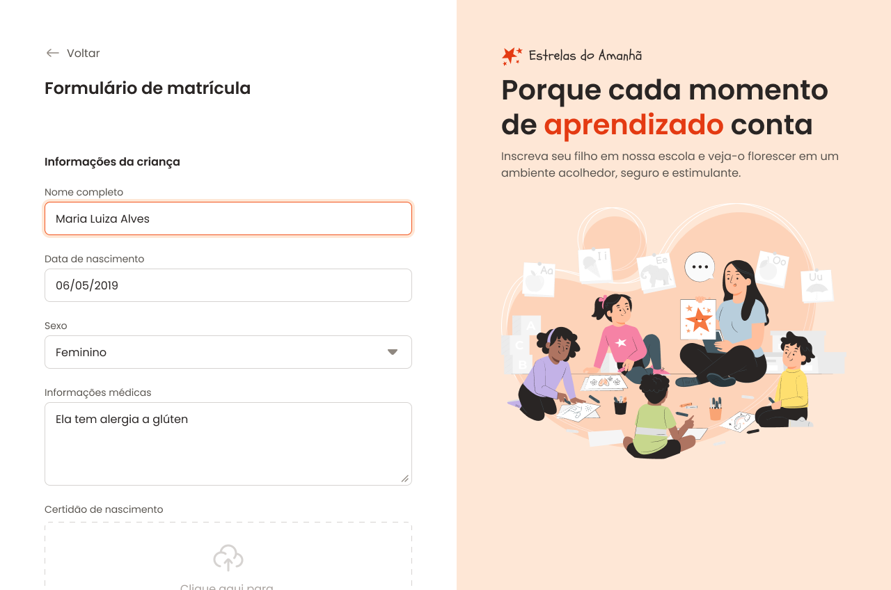

# Formulário de Matrícula - Estrelas do Amanhã



## 📋 Sobre o Projeto

Este projeto é um **formulário de matrícula** para a escola de educação infantil "Estrelas do Amanhã". O foco principal está na **utilização e estilização profissional de componentes de formulário HTML/CSS**.

## 🎯 Objetivo

Demonstrar as melhores práticas no desenvolvimento de formulários web, incluindo:
- ✅ Estruturação semântica com `<form>`, `<fieldset>` e `<legend>`
- ✅ Variedade de tipos de campos de entrada
- ✅ Estilização customizada de componentes
- ✅ Layout responsivo e intuitivo
- ✅ Validação visual e feedback do usuário

## 🎨 Componentes de Formulário

### Inputs de Texto
- **Text**: Nome completo, CEP, Rua, Telefone
- **Email**: Validação de email com mensagem de erro visual
- **Number**: Campo numérico para número da residência
- **Date**: Data de nascimento com seletor visual
- **Text Disabled**: Campos desabilitados com dados pré-preenchidos (Cidade, Estado)

### Seleção
- **Select/Dropdown**: Seleção de sexo (Feminino, Masculino, Prefiro não responder)
- **Radio Buttons**: 
  - Turno de estudo (Manhã, Tarde)
  - Esporte (6 opções: Futebol, Basquete, Natação, Yoga, Voleibol, Boxe)
- **Checkboxes**: Aceitar Termos e Condições

### Textarea
- **Textarea**: Informações médicas com múltiplas linhas

### Upload de Arquivo
- **File Input com Dropzone**: Upload da Certidão de Nascimento com interface visual

### Buttons
- **Botão Secundário**: "Salvar Respostas"
- **Botão Primário**: "Fazer Matrícula" (Submit)

## 📁 Estrutura de Estilos

Os estilos foram organizados de forma modular para facilitar manutenção e escalabilidade:

```
styles/
├── index.css              # Arquivo principal de importações
├── global.css             # Estilos globais e reset
├── layout.css             # Layout geral da página (grid com main e aside)
├── forms.css              # Estilos gerais de formulários (fieldsets, legends)
└── fields/                # Estilos específicos por tipo de campo
    ├── index.css          # Importações dos campos
    ├── input.css          # Estilos para inputs de texto
    ├── buttons.css        # Estilos para botões
    ├── radio.css          # Estilos para radio buttons com ícones
    ├── checkbox.css       # Estilos para checkboxes
    └── droparea.css       # Estilos para drag-and-drop de arquivos
```

## 🎯 Técnicas de Estilização Destacadas

### 1. **Fieldsets Organizados**
O formulário é dividido em seções lógicas usando `<fieldset>`:
- Informações da Criança
- Endereço Residencial
- Informações do Responsável
- Opções de Matrícula

### 2. **Radio Buttons Customizados**
- Substituição de radio buttons nativos por designs customizados
- Integração de ícones SVG para melhor UX
- Estados visuais (checked, hover, focus)

### 3. **Dropzone para Upload**
- Área visual para drag-and-drop de arquivos
- Ícone e texto descritivo
- Design atrativo e intuitivo

### 4. **Validação Visual**
- Mensagem de erro para email inválido
- Ícone de alerta associado
- Layout preparado para feedback do usuário

### 5. **Layout Flexível**
- Uso de `flex` para inputs lado-a-lado (CEP, Rua, Número)
- Classes `flex-1` e `flex-2` para proporções responsivas
- Grid layout para main e aside

### 6. **Wrappers Semanticamente Estruturados**
- `.input-wrapper`: Agrupa label + input
- `.radio-wrapper`: Agrupa múltiplas opções de radio
- `.checkbox-wrapper`: Estilos específicos para checkbox
- `.select-wrapper`: Estilização de selects
- `.textarea-wrapper`: Estilização de textareas

## 🚀 Como Visualizar

1. Abra o arquivo `index.html` no navegador
2. Ou use um servidor local:
   ```bash
   # Com Python 3
   python -m http.server 8000
   
   # Com Node.js (http-server)
   npx http-server
   ```
3. Navegue até `http://localhost:8000`

## 📱 Características

- ✨ Design moderno e responsivo
- 🎨 Paleta de cores consistente (Poppins font)
- 📐 Layout com sidebar ilustrado
- ♿ Estrutura semântica com boas práticas de acessibilidade
- 🔍 Campos com labels associados corretamente
- 💾 Método POST configurado no formulário

## 📚 Aprendizados Principais

Este projeto exemplifica:
- Organização modular de CSS em componentes
- Uso adequado de `<fieldset>` e `<legend>` para agrupar campos
- Customização visual de elementos nativos de formulário
- Estrutura HTML semântica e acessível
- Padrão de classes BEM implícito (wrappers e components)
